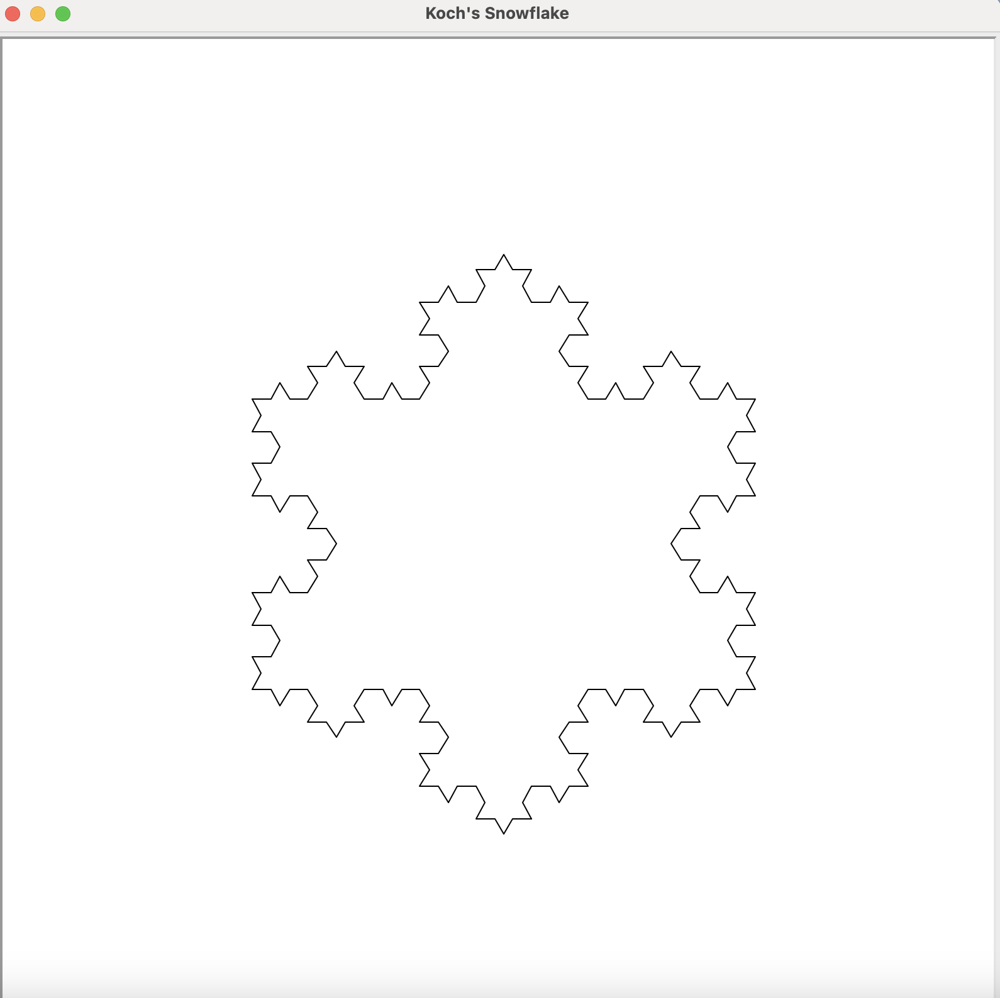
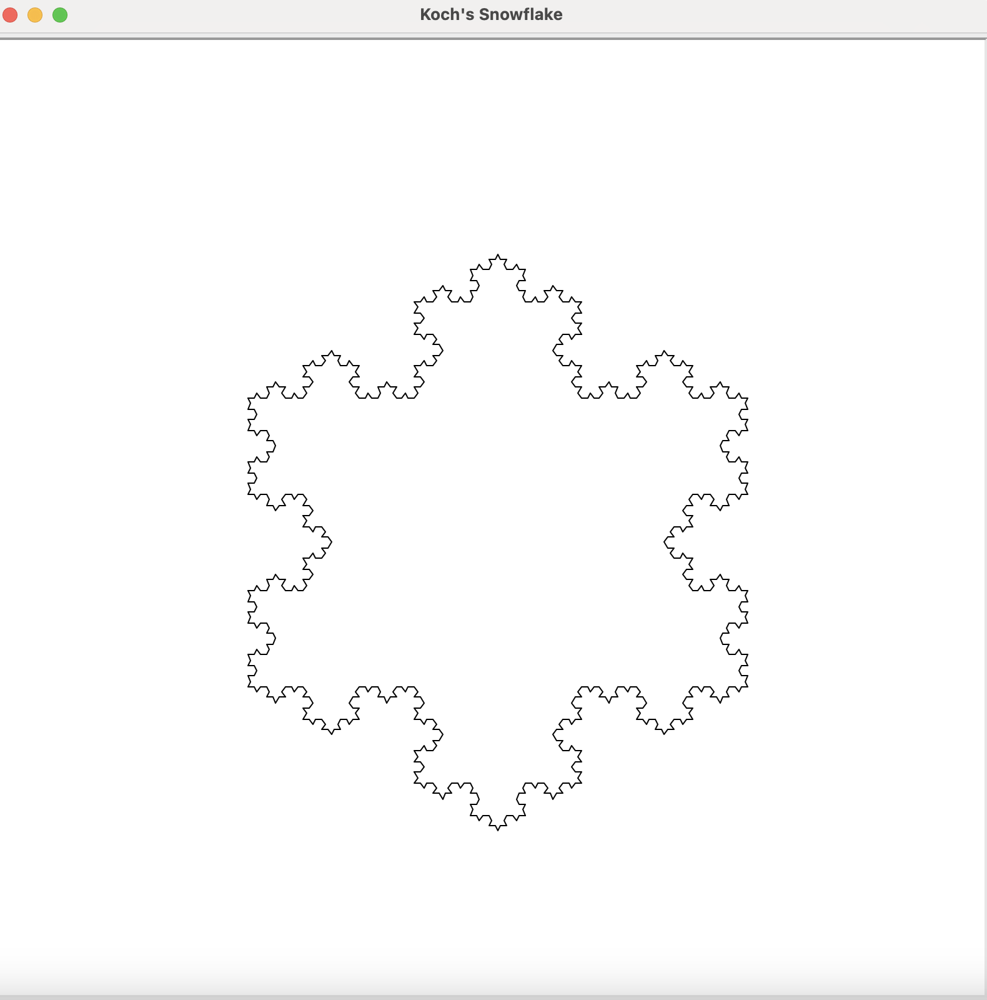

# goit-algo-hw-03
## Завдання 1

### **Напишіть програму на Python, яка рекурсивно копіює файли у вихідній директорії, переміщає їх до нової директорії та сортує в піддиректорії, назви яких базуються на розширенні файлів.**

Також візьміть до уваги наступні умови:

**1. Парсинг аргументів.** Скрипт має приймати два аргументи командного рядка: шлях до вихідної директорії та шлях до директорії призначення (за замовчуванням, якщо тека призначення не була передана, вона повинна бути з назвою dist).


**2. Рекурсивне читання директорій:**

* Має бути написана функція, яка приймає шлях до директорії як аргумент.
* Функція має перебирати всі елементи у директорії.
* Якщо елемент є директорією, функція повинна викликати саму себе рекурсивно для цієї директорії.
* Якщо елемент є файлом, він має бути доступним для копіювання.


**3. Копіювання файлів:**

* Для кожного типу файлів має бути створений новий шлях у вихідній директорії, використовуючи розширення файлу для назви піддиректорії.
* Файл з відповідним типом має бути скопійований у відповідну піддиректорію.

**4. Обробка винятків.** Код має правильно обробляти винятки, наприклад, помилки доступу до файлів або директорій.

**Для запуску скрипту у терміналі:**
```
python task_1.py /шлях/до/вихідної/директорії /шлях/до/директорії/призначення
```
**Або без вказання директорії призначення:**
```
python task_1.py /шлях/до/вихідної/директорії
```

## Завдання 2

### **Напишіть програму на Python, яка використовує рекурсію для створення фракталу «сніжинка Коха» за умови, що користувач повинен мати можливість вказати рівень рекурсії.**

**Для запуску скрипту у терміналі:**
```
python task_2.py

Enter the recursion level for the Koch snowflake: 
```

## **Зразок для рівня 3:**



## **Зразок для рівня 4:**



## Завдання 3

### **Напишіть програму, яка виконує переміщення дисків з стрижня А на стрижень С, використовуючи стрижень В як допоміжний. Диски мають різний розмір і розміщені на початковому стрижні у порядку зменшення розміру зверху вниз.**

#### **Правила:**

1. За один крок можна перемістити тільки один диск.

2. Диск можна класти тільки на більший диск або на порожній стрижень.

Вхідними даними програми має бути число n — кількість дисків на початковому стрижні. Вихідними даними — логування послідовності кроків для переміщення дисків зі стрижня А на стрижень С.

**Для запуску скрипту у терміналі:**
```
python task_3.py
Enter the number of disks: 4
Initial state: {'A': [4, 3, 2, 1], 'B': [], 'C': []}
Move the disk from A on B: 1
Intermediate state: {'A': [4, 3, 2], 'B': [1], 'C': []}
Move the disk from A on C: 2
Intermediate state: {'A': [4, 3], 'B': [1], 'C': [2]}
Move the disk from B on C: 1
Intermediate state: {'A': [4, 3], 'B': [], 'C': [2, 1]}
Move the disk from A on B: 3
Intermediate state: {'A': [4], 'B': [3], 'C': [2, 1]}
Move the disk from C on A: 1
Intermediate state: {'A': [4, 1], 'B': [3], 'C': [2]}
Move the disk from C on B: 2
Intermediate state: {'A': [4, 1], 'B': [3, 2], 'C': []}
Move the disk from A on B: 1
Intermediate state: {'A': [4], 'B': [3, 2, 1], 'C': []}
Move the disk from A on C: 4
Intermediate state: {'A': [], 'B': [3, 2, 1], 'C': [4]}
Move the disk from B on C: 1
Intermediate state: {'A': [], 'B': [3, 2], 'C': [4, 1]}
Move the disk from B on A: 2
Intermediate state: {'A': [2], 'B': [3], 'C': [4, 1]}
Move the disk from C on A: 1
Intermediate state: {'A': [2, 1], 'B': [3], 'C': [4]}
Move the disk from B on C: 3
Intermediate state: {'A': [2, 1], 'B': [], 'C': [4, 3]}
Move the disk from A on B: 1
Intermediate state: {'A': [2], 'B': [1], 'C': [4, 3]}
Move the disk from A on C: 2
Intermediate state: {'A': [], 'B': [1], 'C': [4, 3, 2]}
Move the disk from B on C: 1
Intermediate state: {'A': [], 'B': [], 'C': [4, 3, 2, 1]}
Final state: {'A': [], 'B': [], 'C': [4, 3, 2, 1]}
```